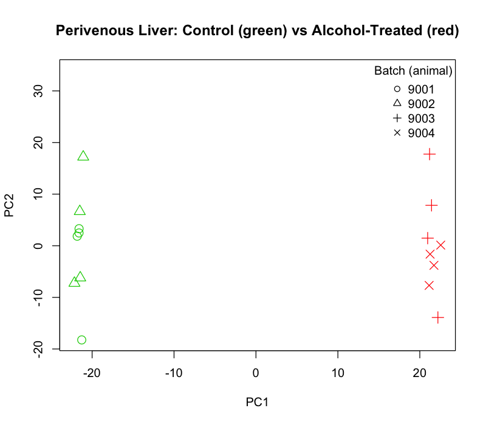
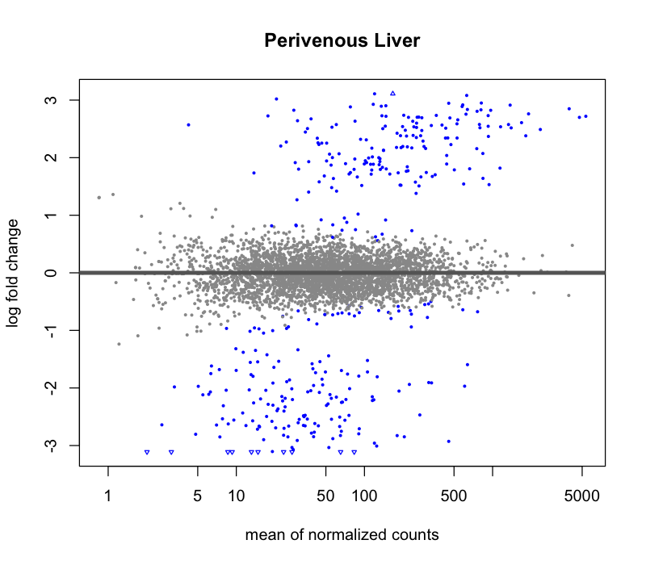
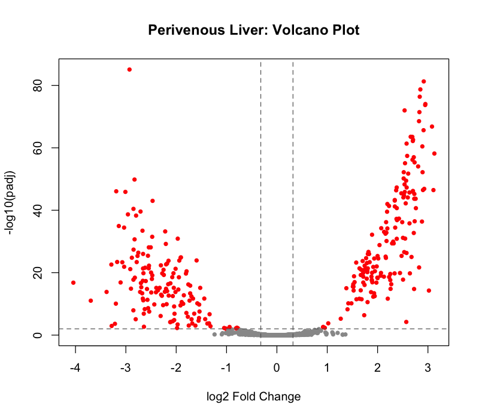
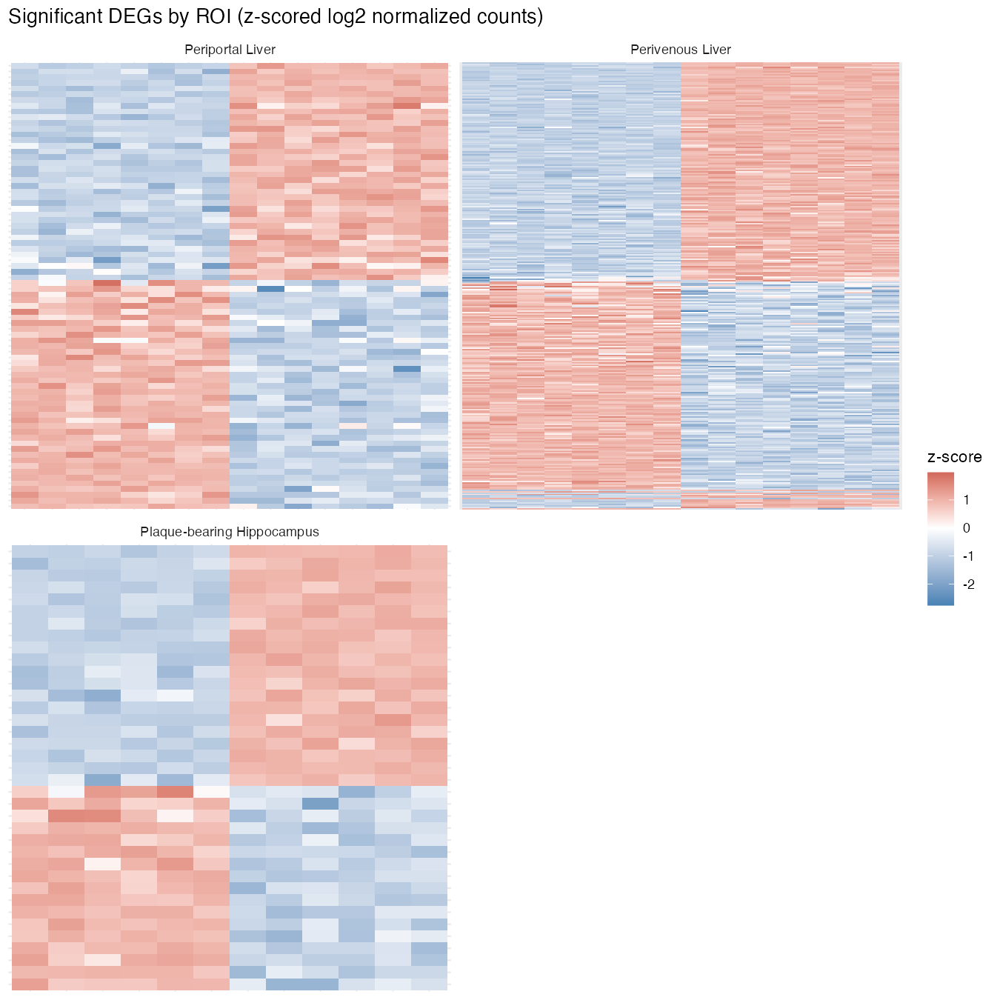

# Liver & Brain Alcohol-Treatment DGE Pipeline

Reproducible DESeq2 pipeline for the "Hepatic and Brain Spatial Gene 
Expression Changes in Intragastric Alcohol Fed APP/PS1 Alzheimer's Disease
Mouse Model" study. This includes spatial transcriptomic data sourced from 
brain and liver regions of interest (ROIs): 
Brain - plaque-bearing/plaque-free cortex and hippocampus
Liver - periportal/perivenous 

This pipeline can be executed using the provided synthetic data until the
study becomes public. Once available, placeholder files can be replaced 
with published data, Accession GSE324193. 


```bash
git clone <this-repo-url>
cd liver-brain-alcohol-dge-pipeline
Rscript run_pipeline.R
```

## Methods

For each of the 6 ROIs, DESeq2 (`~ Group`, Control as reference) compares
alcohol-treated vs. control samples. Statistically significant differentially
expressed genes (DEGs) were identified using `padj <= 0.01` and`log2FoldChange > ±0.32` 
threshold with Benjamini-Hochberg FDR correction. ROI genelists with fewer than 10 
significant DEGs are excluded from downstream analyses. 
Note: Batch (animal ID) is recovered from each sample's ID and used for PCA QC.

## Data

`config.yml`'s `data_source` controls where data comes from:

| Mode | Setting | Purpose |
|---|---|---|
| Example (default) | `local`, paths → `data/example/` | Synthetic 72-sample dataset, same design as the real study. Not real measurements. |
| Real data | `local`, paths → `data/raw/` | Point `config.yml` at `data/raw/` once you have the real files locally (not in this repo). |
| GEO | `geo`, `geo.accession` set | Downloads the raw counts from GEO once published. Metadata still comes from the local file (see `R/01_fetch_from_geo.R`). |

`data/raw/` is gitignored — the real dataset stays off GitHub until published.

## Figures

Every run produces `results/figures/`: PCA, MA, and volcano plots per
ROI, plus a combined per-ROI heatmap grid. Examples from the synthetic data:

**PCA** — Control (green) vs. Alcohol-Treated (red), shaped by batch:



**MA plot:**



**Volcano plot** — significant genes in red:



**Heatmap** — each ROI's own significant genes, z-scored:



## Structure


```
config.yml                     ROI definitions, thresholds, data settings
R/
  00_setup.R                   loads config + shared functions
  01_fetch_from_geo.R          no-op unless data_source: geo
  02_prepare_metadata.R        parses metadata
  03_pca_plots.R               PCA per ROI, before any DESeq2 object exists
  04_run_dge_all_rois.R        DESeq2 + MA/volcano plots per ROI (loop)
  04_run_dge_all_rois_no_loop.R   same steps, no loop -- change roi_name and re-run
  05_compare_deg_lists.R       shared/unique DEGs across plaqueHippo, periportal, perivenous
  06_render_heatmap.R          per-ROI heatmap grid
  functions.R                  load_raw_counts(), subset_counts_by_tissue()
run_pipeline.R                 runs 00-06 in order
data/
  example/                     synthetic demo dataset (committed)
  raw/                         real data goes here (gitignored)
results/
  normalized_counts/, deg_tables/, comparisons/, figures/
docs/figures/                  example images used in this README
```

Requires R with `DESeq2`, `readxl`, `dplyr`, `tidyr`, `stringr`, `ggplot2`,
`yaml`. `GEOquery` is only needed for `data_source: geo`.

## Validation

Run on the real dataset, results matched the original per-ROI scripts:
`plaqueCortex` 0 significant genes, `plaqueHippo` 96, `periportal`/
`perivenous` 182/805 (same order of magnitude as the original 189/~802-807
— those scripts ran on an older, smaller probe panel). Only `plaqueHippo`,
`periportal`, and `perivenous` clear the 10-gene threshold, so those three
are what carry into the comparison and heatmap step.
