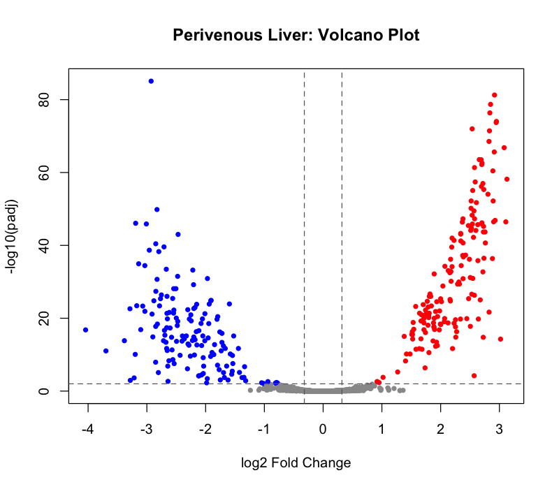
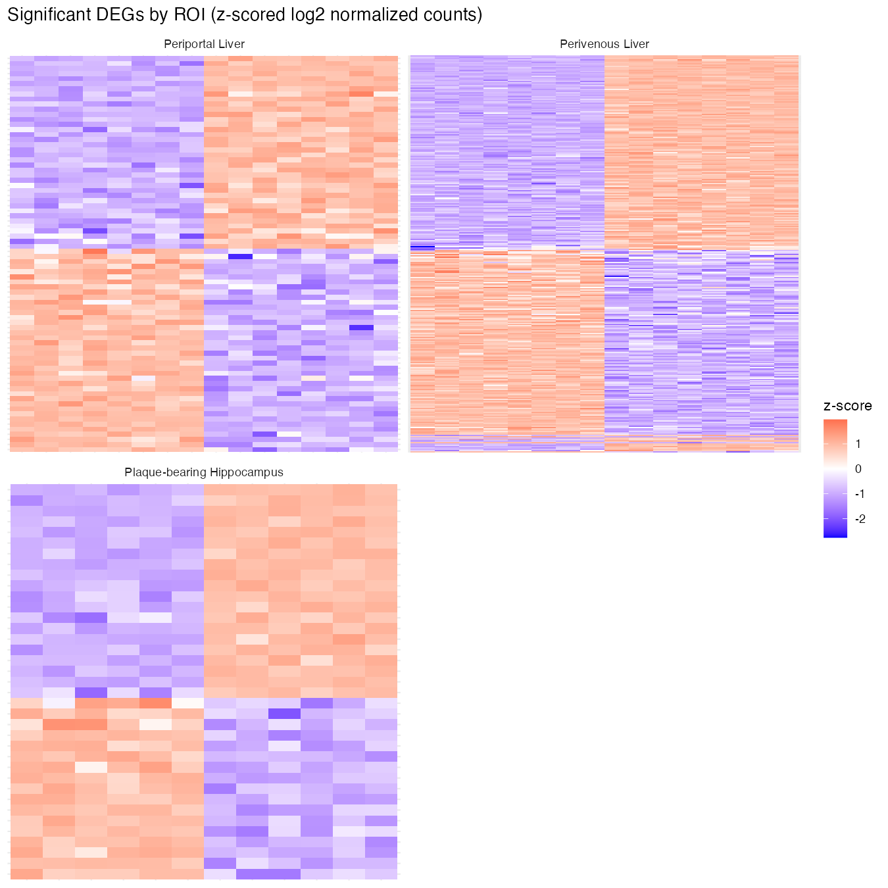

# APPPS1-Alcohol-Liver-Brain-Spatial-Transcriptomics

This repository contains a reproducible `DESeq2` analysis pipeline designed to explore how chronic alcohol consumption influences Alzheimer's Disease (AD) pathology. By analyzing spatial transcriptomics data from the liver and brain of APP/PS1 mice intragastrically fed alcohol for 5 weeks, this pipeline identifies differentially expressed genes (DEGs) to map molecular changes associated with chronic alcohol consumption within highly specific tissue microenvironments.

This pipeline can be executed using the provided synthetic data until the study becomes public. Once available, placeholder files can be replaced with published data from GEO.

``` bash
git clone <this-repo-url>
cd liver-brain-alcohol-dge-pipeline
Rscript run_pipeline.R
```

## Methods

For the six regions of interest (ROIs), DESeq2 compares alcohol-treated vs. control samples within each ROI, defining the design formula as `~ Group` with controls set as reference. Statistically significant DEGs are identified using `padj <= 0.01` and`log2FoldChange > ±0.32` threshold with Benjamini-Hochberg FDR correction. ROI gene lists with fewer than 10 significant DEGs are excluded from downstream analyses. Note: Batch (animal ID) is recovered from each sample's ID and used for PCA QC.

## Data

`config.yml`'s `data_source` controls where data comes from:

| Mode | Setting | Purpose |
|------------------------|------------------------|------------------------|
| Example (default) | `local`, paths → `data/example/` | Synthetic 72-sample dataset, same design as the real study. Not real measurements. |
| Real data | `local`, paths → `data/raw/` | Point `config.yml` at `data/raw/` once you have the real files locally (not in this repo). |
| GEO | `geo`, `geo.accession` set | Downloads the raw counts from GEO once published. Metadata still comes from the local file (see `R/01_fetch_from_geo.R`). |

`data/raw/` is gitignored — the real dataset stays off GitHub until published.

## Figures

Every run produces `results/figures/`: PCA, MA, and volcano plots per ROI, along with a faceted plot containing all output heatmaps per ROI. Examples from the synthetic data:

**PCA** — Control (green) vs. Alcohol-Treated (red), shaped by batch:


**MA plot:**


**Volcano plot** — significant genes in red:



**Heatmap** — each ROI's own significant genes, z-scored:



`results/deg_tables/` contains the DESeq2 output from the example run, 
per ROI:`<ROI>_AllDEGs.csv` (complete ranked gene list) and
`<ROI>_SigDEGs_*.csv` (statistically significant DEGs).

## Structure

```         
config.yml                     ROI definitions, thresholds, data settings
R/
  00_setup.R                   loads config + shared functions
  01_fetch_from_geo.R          no-op unless data_source: geo
  02_prepare_metadata.R        parses metadata
  03_pca_plots.R               PCA per ROI, before any DESeq2 object exists
  04_run_dge_all_rois.R        DESeq2 + MA/volcano plots per ROI (loop)
  04_run_dge_all_rois_no_loop.R   same steps, no loop -- change roi_name and re-run
  05_compare_deg_lists.R       shared/unique DEGs across plaqueHippo, periportal, perivenous
  06_render_heatmap.R          per-ROI heatmap grid
  functions.R                  load_raw_counts(), subset_counts_by_tissue()
run_pipeline.R                 runs 00-06 in order
data/
  example/                     synthetic demo dataset (committed)
  raw/                         real data goes here (gitignored)
  processed/                   pipeline-generated intermediate files (gitignored)
results/
  normalized_counts/, comparisons/     each run's output (gitignored, regenerated)
  deg_tables/                  DESeq2 output per ROI (committed, from the example run)
  figures/                     plots from your last run, plus example_*.png (committed, used in this README)
```

Requires R with `DESeq2`, `readxl`, `dplyr`, `tidyr`, `stringr`, `ggplot2`, `yaml`. `GEOquery` is only needed for `data_source: geo`.

## Validation

Ran on the real dataset, results matched the original per-ROI scripts and statistically significant DEG lists: `nonplaqueCortex` 3 DEGs, `plaqueCortex` 0 significant genes, `nonplaqueHippo` 0 signifigant genes, `plaqueHippo` 97, `periportal` 189 DEGs, `perivenous` 802 DEGs . Only `plaqueHippo`, `periportal`, and `perivenous` contained more than 10 significant DEGs and were included in downstream pathway and network analyses.
