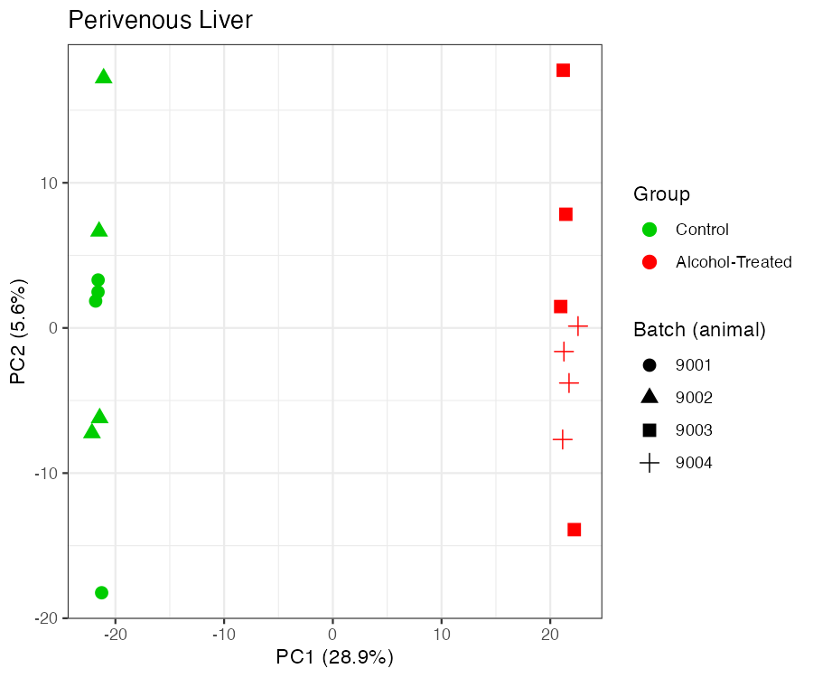

# Liver & Brain Alcohol-Treatment DGE Pipeline

Reproducible DESeq2 differential gene expression (DGE) pipeline for spatial
transcriptomics ROIs from the intragastric alcohol-fed APP/PS1 mouse study
(brain: plaque-bearing/plaque-free cortex and hippocampus; liver:
periportal/perivenous).

The real study data isn't public yet, so this pipeline ships with a small
synthetic example dataset and runs out of the box:

```bash
git clone <this-repo-url>
cd liver-brain-alcohol-dge-pipeline
Rscript run_pipeline.R
```

## Methods (as implemented)

For each of 6 ROIs, DESeq2 (design `~ Group`, `Control` as the reference
level) compares alcohol-treated (`ethanol`) vs. control samples. Genes with
`padj <= 0.01` and `log2FoldChange > 0.32` or `< -0.32` are significant.
Multiple-testing correction is DESeq2's default Benjamini-Hochberg FDR. ROI
DEG lists with fewer than 10 significant genes are excluded from the
cross-ROI comparison. Raw counts are DESeq2-size-factor normalized and
log2-transformed for visualization.

Batch (animal ID) isn't a separate metadata field, so it's recovered from
each sample's `*library name` (e.g. `Tg-Cont-6876-...`) and used for PCA QC.

## Data

Three ways to get data into the pipeline, controlled by `config.yml`:

| Mode | `data_source` | What it does |
|---|---|---|
| Example (default) | `local`, paths → `data/example/` | Synthetic 72-sample dataset, same ROI design as the real study, DEG pattern shaped to roughly match the manuscript (liver ≫ hippocampus > cortex). Not real measurements. |
| Real data | `local`, paths → `data/raw/` | Once you have `MetaData.xlsx` + `RawCounts_AllSamples.csv` locally (not in this repo — see below), point `config.yml`'s `paths` at `data/raw/`. |
| GEO | `geo`, `geo.accession` set | Once this dataset is published, downloads `RawCounts_AllSamples.csv` from GEO via `GEOquery::getGEOSuppFiles()` and overwrites `raw_counts_csv` before the pipeline runs. Metadata still comes from the local file either way — GEO only exposes it as free-text characteristics keyed to GSM accession, not to the `*library name` values the counts matrix uses as column headers, and that mapping isn't reliable to re-derive until a real accession exists. `R/01_fetch_from_geo.R`'s download mechanics were dry-run tested against a real, unrelated published series. |

`data/raw/` is gitignored — the real dataset is unpublished and never gets
committed here. ROI membership is derived from `tissue` + `region` (+
`pathology` for brain ROIs), not sample-name string matching.

`data/example/generate_example_data.R` regenerates the synthetic dataset
(already committed, so you don't need to run it).

## Figure outputs

`results/figures/` (regenerated fresh from the example data on every run):

- `<ROI>_PCA.pdf`/`.png` — PCA per ROI, colored by Group, shaped by batch (animal).
- `significant_DEGs_heatmap_by_roi.pdf`/`.png` — one heatmap panel per included ROI (that ROI's own significant genes, z-scored, not a gene union across ROIs), laid out as a 2-column grid.

Example output on the synthetic dataset:

**PCA (perivenous)** — Group (color) vs. batch/animal (shape):



**Per-ROI heatmaps, z-scored, 2-column grid:**


## Running

```bash
Rscript run_pipeline.R
```

Requires R with `DESeq2`, `readxl`, `dplyr`, `tidyr`, `stringr`, `ggplot2`,
`yaml` installed. `GEOquery` is only needed for `data_source: geo`.

## Structure

```
config.yml                     ROI definitions, thresholds, data_source/geo settings
R/
  00_setup.R                   loads config + shared functions
  01_fetch_from_geo.R          no-op unless data_source: geo
  02_prepare_metadata.R        parses metadata -> data/processed/sample_metadata.csv
  03_pca_plots.R               PCA/QC per ROI on raw counts (log2(counts+1)), before any DESeq2 object exists
  04_run_dge_all_rois.R        DESeq2 (build dds -> normalize -> filter -> fit) per ROI, looped over config.yml's 6 ROIs
  04_run_dge_all_rois_no_loop.R   same steps, no loop -- change roi_name and re-run instead
  05_compare_deg_lists.R       shared/unique DEGs across plaqueHippo, periportal, perivenous
  06_render_heatmap.R          per-ROI heatmap grid (ggplot2 facet_wrap)
  functions.R                  load_raw_counts(), subset_counts_by_tissue()
run_pipeline.R                 orchestrator; sources 00-06 in order
data/
  example/                     synthetic demo dataset (committed)
  raw/                         real data goes here (gitignored, not committed)
results/
  normalized_counts/           <ROI>_log2NormalizedCounts.csv
  deg_tables/                  <ROI>_AllDEGs.csv, <ROI>_SigDEGs_*.csv
  comparisons/                 gene_summary.csv (every significant gene x which ROI(s) it's in)
  figures/                     PCA plots, per-ROI heatmap grid
docs/figures/                  example output images used in this README
```

## Validation against the original per-ROI scripts

Re-run on the real combined dataset, results matched the original per-ROI
analyses closely: `plaqueCortex` 0 significant genes (matches the original
`.html` output), `plaqueHippo` 96 (matches `...96DEGs...csv`), `periportal`/
`perivenous` 182/805 (same order of magnitude as the original 189/~802-807 —
the original liver scripts ran on an older, smaller probe panel).
`nonplaqueCortex` and `nonplaqueHippo` have no prior run to compare against
(`nonplaqueHippo` wasn't in the original script set at all). Because
`plaqueCortex`, `nonplaqueCortex`, and `nonplaqueHippo` fall below the
10-gene threshold, only `plaqueHippo`, `periportal`, and `perivenous` carry
into the cross-ROI comparison and heatmaps on the real data.
